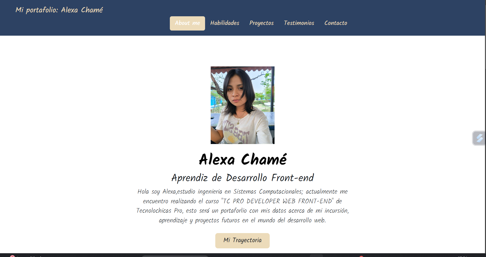

# Portafolio de Alexa Guadalupe Chame Velazquez 
## proyecto responsivo creado en el bootcamp de Tecnolochicas Pro 

Proyecto creado durante el bootcamp de desarrollo front-end de Tecnolochicas Pro, es run proyecto responsivo, la finalidad de mi pagina web es mostrar mi portafolio con mis proyectos de desarrollo web. 

Puedes verlo aquí [GitHub] 
(https://github.com/alexaaloey/alexaaloey.github.io)

### Tecnologias 
 
 * HTML
 * CSS
 * Bootstrap 5
 * JS

 ### El proyecto cuenta con las siguientes secciones

* Sobre mi (presentacion breve)
* Habilidades 
* Proyectos
* Testimonios
* Contacto 

### Captura del proyecto

